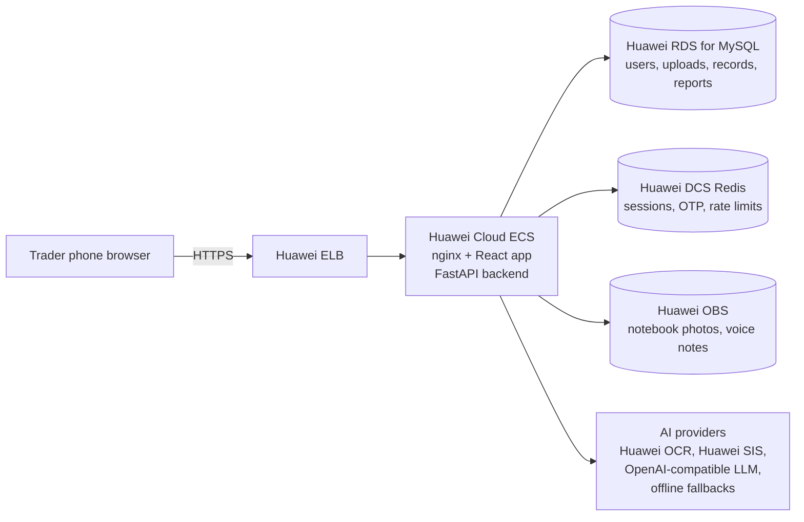

# NotebookOS

> **Your business already has a database. It's just handwritten.**

NotebookOS turns a trader's handwritten notebook page or voice note into structured,
searchable business records. Every number on the dashboard can be traced back to the
line in the notebook it came from, and nothing becomes official until the trader confirms it.

Built for the Huawei ICT Competition, Innovation track (hackathon MVP).

**Live demo:** https://notebook-os-xi.vercel.app. Choose *Open the demo account*.
All data is fictional. The backend runs on a free tier: the first visit after a quiet
period can take about a minute to wake it up.

---

## The problem

Many small traders keep their business records in a paper notebook: sales, goods given
on credit (*bashi*), repayments, expenses, and restocks. The notebook works, but its
contents can't be searched or totalled. It can't show who still owes money, and it
can't produce a summary a lender could read.

## The solution

1. **Capture.** Photograph a notebook page, record a voice note, or type entries.
2. **Read.** OCR or speech-to-text produces the raw text, with a bounding box for each line.
3. **Understand.** An interpreter turns messy English, Hausa or mixed text into strict
   structured records. Unclear values become `null` rather than guesses, and each field
   gets a confidence score.
4. **Validate.** Deterministic checks run on every record: amounts, dates, required
   people, suspicious totals. They also verify that each amount and name actually
   appears in the source text.
5. **Human confirmation.** Uncertain fields are highlighted, and the trader corrects
   and confirms. Only **CONFIRMED** records count.
6. **Summarize.** Application code calculates every metric. No LLM does arithmetic.
7. **Provenance.** Click any number, such as *Outstanding Debt ₦40,000*, to see the
   contributing records, the original text, and the highlighted line on the notebook photo.
8. **Report.** A one-page business summary with a revocable, read-only share link.

```
Musa shinkafa 2? 20k bashi      ← smudged notebook line (OCR confidence 61%)
        ↓ AI extraction
Musa — ₦20,000 — Debt, quantity: unclear (61%)
        ↓ trader enters quantity 2, confirms
Dashboard: Outstanding Debt ₦40,000 → Musa (page 2, row 4) + Aisha (page 5, row 3)
```

## Architecture



| Layer | Technology |
|---|---|
| Frontend | React 19 + TypeScript + Vite, mobile-first, no UI framework |
| Backend | Python 3.12, FastAPI, SQLAlchemy 2.0, Alembic |
| Database | MySQL 8 (Huawei RDS) in Docker/production; SQLite for quick local runs and tests |
| Cache/sessions | Redis (Huawei DCS); in-process fallback for single-process dev |
| Files | Local disk in development; Huawei OBS (S3-compatible API) in production |
| AI | `OCRProvider`, `SpeechProvider`, and `LLMProvider` interfaces with Huawei, OpenAI-compatible, rule-based and offline demo implementations |

See [docs/architecture.md](docs/architecture.md) and [docs/ai-pipeline.md](docs/ai-pipeline.md).

## Repository layout

```
backend/    FastAPI app (api, auth, extraction, validation, analytics, provenance, reports, providers)
frontend/   React app (pages, components, hooks, services, i18n)
samples/    Fictional notebook pages, voice note, and their offline demo readings
deploy/     Huawei Cloud ECS production compose, Caddyfile, env template, smoke check
docs/       Architecture, API, AI pipeline, deployment, security, demo script
```

## Local setup

### Option A: Docker (MySQL + Redis, closest to production)

```bash
cp .env.example .env            # optional; defaults work for the demo
docker compose up --build
# open http://localhost:8080 and choose "Open the demo account"
```

This starts MySQL 8.4 (standing in for RDS), Redis 7 (standing in for DCS), the backend,
and the nginx-served frontend. On start the backend runs migrations and seeds the
fictional demo account.

### Option B: Run directly (fast dev loop, SQLite)

Requires Python 3.12+ and Node 20+.

```bash
# backend
cd backend
python -m venv .venv
.venv/Scripts/activate          # Windows; macOS/Linux: source .venv/bin/activate
pip install -r requirements.txt pytest
alembic upgrade head
python -m app.cli seed-demo
OTP_DEV_ECHO=true uvicorn app.main:app --reload --port 8000

# frontend (second terminal)
cd frontend
npm install
npm run dev                     # http://localhost:5173 (proxies /api to :8000)
```

## Environment variables

All configuration is in environment variables. [.env.example](.env.example) documents
every variable, and [deploy/env.production.example](deploy/env.production.example) shows
the production values for Huawei Cloud. The main groups:

| Variable | Purpose |
|---|---|
| `DATABASE_URL` | SQLAlchemy URL. RDS: `mysql+pymysql://user:pass@<private-ip>:3306/notebookos?charset=utf8mb4` |
| `REDIS_URL` | DCS Redis URL. Empty means an in-process store (single process only). |
| `STORAGE_BACKEND`, `OBS_*` | `local` or `obs` (private bucket, served via the API) |
| `OCR_PROVIDER`, `SPEECH_PROVIDER` | Provider chains, e.g. `huawei,demo` (try Huawei, then the offline demo fixture) |
| `LLM_PROVIDER`, `LLM_*` | `rules` (deterministic, offline) or `openai_compatible` (e.g. ModelArts MaaS), with fallback to rules |
| `HUAWEI_*` | IAM credentials, project and region for Huawei OCR/SIS |
| `CONFIDENCE_HIGH`, `CONFIDENCE_REVIEW` | Review thresholds (defaults 0.85 / 0.60) |
| `CURRENCY`, `LOCALE`, `EXTRACTION_LANGUAGES`, `DATE_ORDER` | Market settings. Nothing is hard-coded to one country. |
| `DEMO_MODE`, `OTP_DEV_ECHO` | Demo account and dev OTP echo. The app refuses to start in production with `OTP_DEV_ECHO=true`. |

Never commit `.env` files. `.gitignore` excludes them.

## Running tests

```bash
cd backend && .venv/Scripts/python -m pytest      # 85 tests
cd frontend && npm test                           # vitest unit tests
cd frontend && npm run build                      # type-check + production build
```

The backend tests cover auth/OTP, upload validation, OCR response parsing, LLM JSON
validation (malformed output, invented line references), record edit/confirm/reject,
deterministic metrics (including the spec's ₦100,000 / ₦20,000 / ₦40,000 test),
provenance, reports and share tokens, authorization between users, deletion, error
handling, migrations, and a full **upload → extraction → review → confirm → dashboard
→ evidence → report** end-to-end test.

## Demo account and workflow

The demo account holds **fictional data only**. Choose *Open the demo account* on the
sign-in screen. It is preloaded with two pages of earlier history (Notebook C, pages 4–5),
clearly labelled as *seeded demo history*. Then:

1. **Capture** → *Demo samples* → *Notebook A — page 2*.
2. Review: Musa's row is flagged at 61% and its quantity is unclear. Click **Edit**,
   enter quantity 2, then **Save**.
3. **Confirm 5 records** → the dashboard updates.
4. Click **Outstanding Debt ₦40,000** → evidence for Musa (page 2, row 4) and Aisha
   (page 5, row 3), with the source lines highlighted on the notebook photos.
5. **Report** → tick consent → **Generate report** → **Copy share link**, and open it
   in a private window.

The full timed script is in [docs/demo-script.md](docs/demo-script.md).
*Reset demo data* (on the Capture screen) restores the starting state.

The demo works fully offline. The bundled samples are read by an **offline demo
provider** that returns a pre-recorded reading for those exact files, and the UI labels
it *Demo reading (offline)*. Any other photo needs a real OCR provider (Huawei OCR). If
none is available, the app says so and offers manual entry.

## Deployment

**Current (interim):** the frontend is on **Vercel** (`frontend/vercel.json`, with
`VITE_API_BASE` set to the API URL), and the API is on **Render** (`render.yaml`,
Docker). It runs with SQLite and in-process sessions (`ALLOW_EPHEMERAL=true`), so data
resets whenever Render restarts. The fictional demo account is re-seeded on every
start.

**Target:** Huawei Cloud. The web app and API run on ECS, with data in RDS for MySQL and
AI on ModelArts + OCR. See [docs/deployment.md](docs/deployment.md) for ECS, RDS, DCS,
OBS, networking, HTTPS, migrations, and health checks.

## Status: what is and isn't verified

| Area | Status |
|---|---|
| Upload → extraction → review → confirm → dashboard → evidence → report | Automated end-to-end test, and driven in a real browser (Edge, phone and desktop sizes) |
| Rule-based extraction (English/Hausa/mixed) | Unit-tested on realistic fictional lines. It is a heuristic reader, and its accuracy on real notebooks has **not** been measured. |
| Docker stack with MySQL 8.4 + Redis 7 | Verified locally: migrations apply to MySQL, demo seeds, `/api/health/dependencies` reports mysql/redis, and the full demo flow passes in a browser against the nginx production build |
| Huawei Cloud OCR, SIS, IAM providers | Implemented against the documented APIs and tested with mocked responses only. **Not yet tested against live Huawei services.** |
| OpenAI-compatible LLM provider | Tested with a mocked HTTP endpoint only |
| Huawei OBS storage | Implemented via the S3-compatible API; **not yet tested against a live bucket** |
| Live deployment | Running on Vercel (frontend) + Render (API). The full demo flow was verified in a browser against the live site. Data is not persistent yet. |
| Deployment to Huawei Cloud | Configuration and runbook provided; **not yet deployed** |
| Huawei ModelArts (required by the competition) | **Not integrated yet.** The LLM step already accepts an OpenAI-compatible endpoint such as ModelArts MaaS, but it has not been configured or tested. |
| SMS delivery for OTP | **Not implemented.** The OTP architecture is in place, but production needs an SMS gateway plugged in (see docs/security.md). |
| Hausa UI labels | Partial, and need review by a native speaker |

## License

MIT. See [LICENSE](LICENSE).
