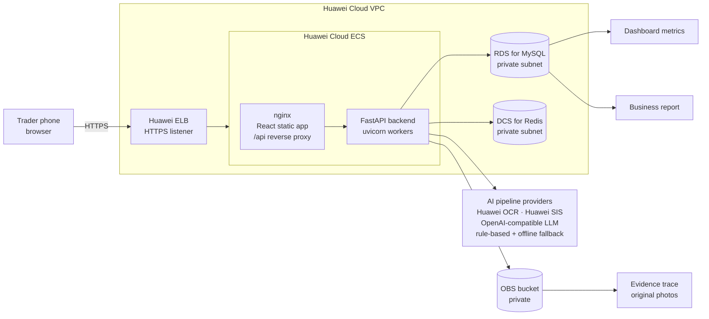
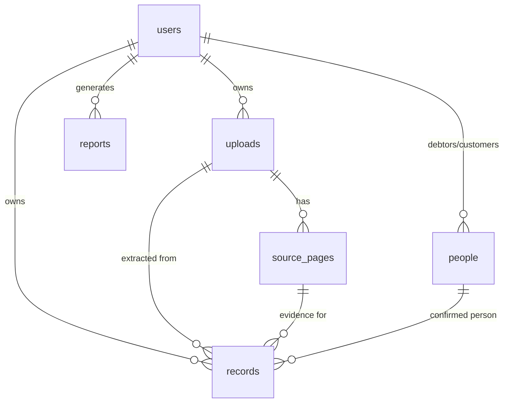
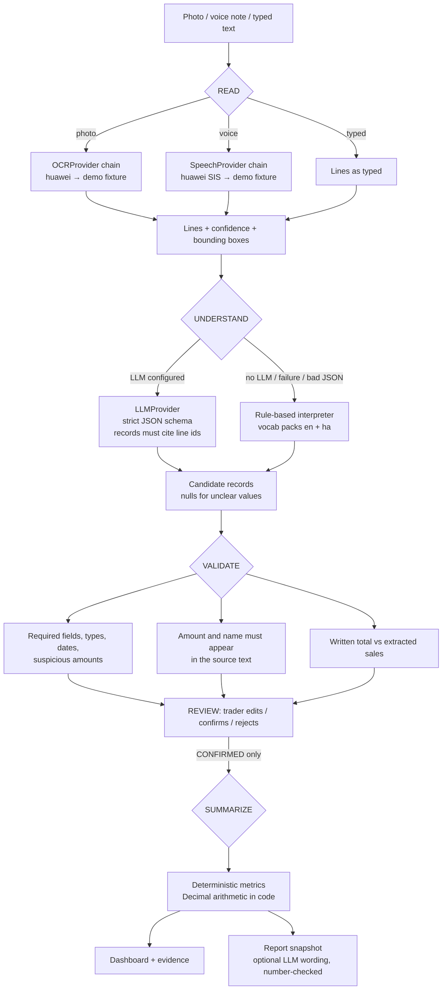
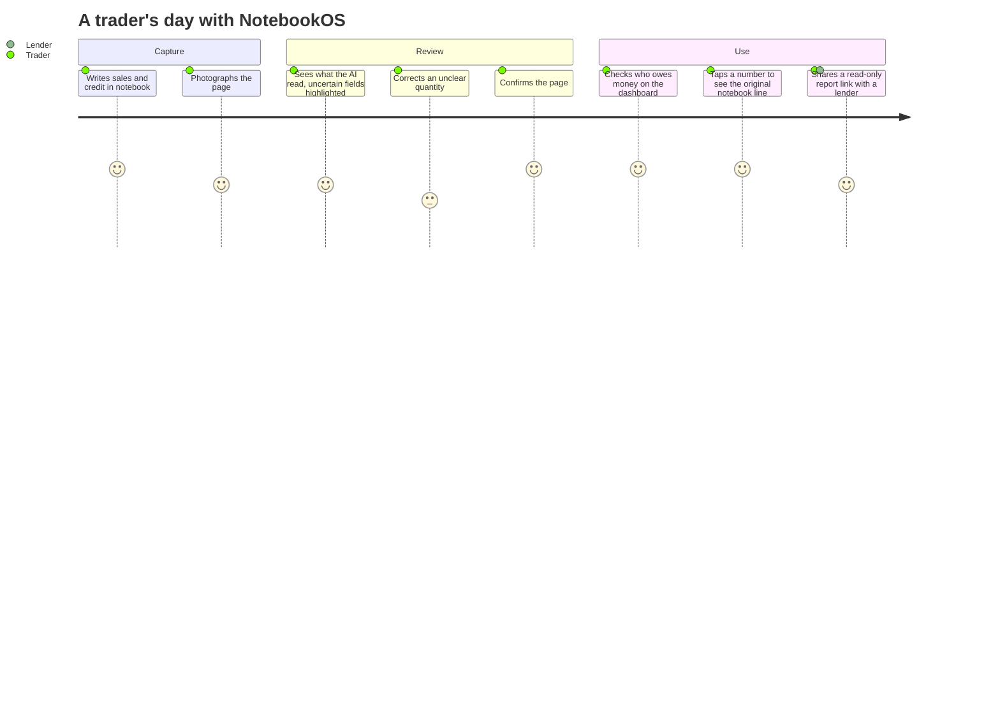
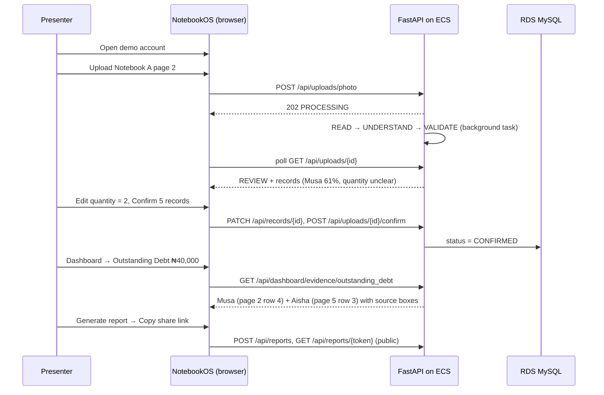

# Architecture

NotebookOS is a single web application with a clean internal split. It deliberately
avoids microservices: one FastAPI backend, one React frontend, and managed Huawei
Cloud data services.

## Production architecture (Huawei Cloud)



| Huawei Cloud service | What it actually does in NotebookOS |
|---|---|
| **ECS** | Runs the two containers: nginx (frontend and `/api` proxy) and the FastAPI backend |
| **RDS for MySQL** | System of record: users, uploads, source pages, records, people, reports |
| **DCS for Redis** | Session tokens (hashed), OTP challenges, rate-limit counters, shared by all workers |
| **OBS** | Original notebook photos and voice notes. The bucket is private and files are streamed through the authenticated API. |
| **ELB** | Public HTTPS termination and health checks (`/health`) |
| **OCR / SIS** | Optional READ-stage providers behind `OCRProvider` and `SpeechProvider` |

## Backend modules

```
app/
  api/          HTTP routers (auth, uploads, records, dashboard, reports, meta, health)
  auth/         OTP + session service, auth/rate-limit dependencies
  core/         config, database, KV store (Redis/memory), file storage (local/OBS), logging
  models/       SQLAlchemy entities
  providers/    OCRProvider / SpeechProvider / LLMProvider interfaces + implementations
  extraction/   UNDERSTAND stage: vocab packs, normalisers, rule-based + LLM interpreters
  validation/   VALIDATE stage: deterministic checks, confidence levels, written-total check
  services/     pipeline orchestration, uploads, human-in-the-loop record operations
  analytics/    SUMMARIZE stage: pure, deterministic metric functions
  provenance/   record → source trace, serialisation
  reports/      report snapshot, narrative, share tokens
  demo/         fictional demo account seeding
```

## Data model



* `records.status`: `AI_EXTRACTED` → `NEEDS_REVIEW` → `CONFIRMED` / `REJECTED`. **Only
  `CONFIRMED` records feed metrics and reports.**
* Provenance columns on `records`: `upload_id`, `source_page_id`, `source_reference`
  (`page-2-row-4`), `original_text`, `bbox_*` (fractions of the page), `confidence`,
  `field_confidence`, `ai_original` (the AI's untouched proposal, kept for audit), and
  `edited` / `confirmed_at`.
* `source_pages.lines` keeps every OCR line with its confidence and bounding box. These
  include lines that produced no record, such as headings and written totals.
* `reports.snapshot` freezes the figures at generation time, so a shared link stays stable.
* Primary keys are random UUIDs, which are not enumerable.

## AI pipeline



## User journey



## Judge demo flow



## Design decisions and assumptions

* **Monolith with background tasks.** Processing runs as a FastAPI background task, and
  the client polls the upload's status. That is enough for an MVP. A queue (for example
  Huawei DMS) can replace it without changing the API.
* **"Debt" means credit given to a customer.** `DEBT` records increase what customers
  owe the trader. `PAYMENT` records are repayments from customers. Money the trader owes
  suppliers is not modelled yet (use `EXPENSE`/`RESTOCK` or `OTHER`).
* **Total Sales means cash sales** (`SALE` records). Credit given is reported separately
  as *Credit Given*.
* **Outstanding debt** is per person: `max(credit − repayments, 0)`, summed. People are
  matched by case- and whitespace-insensitive name.
* **Dates** written as a page heading apply to the lines below them. A missing year is
  taken from the upload date, and that field is given lower confidence.
* **Editing a confirmed record** returns it to review. It must be confirmed again before
  it counts.
* **Deleting an upload** deletes its stored file and every record extracted from it. The
  UI warns how many confirmed records will be removed.
